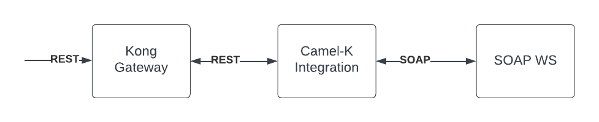
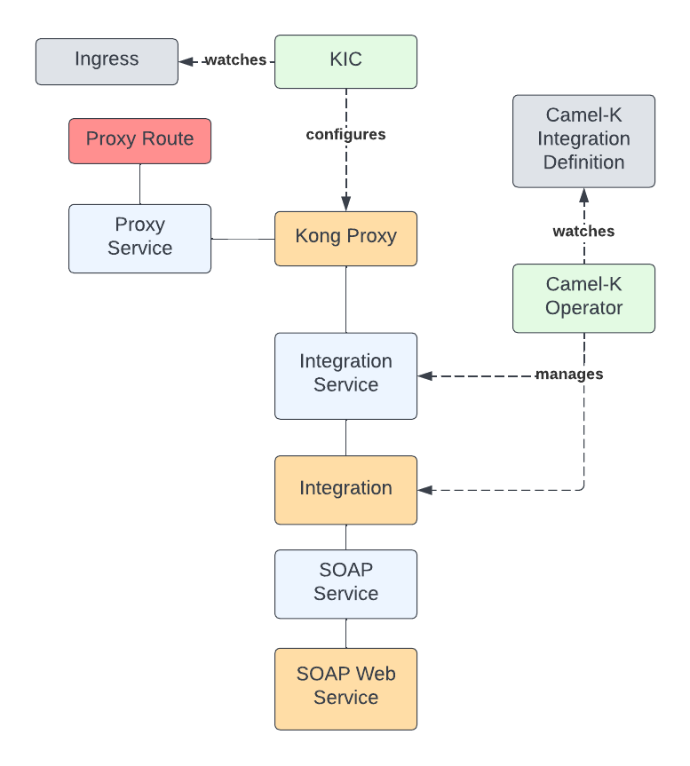

# Kong Gateway with Red Hat Integration - Camel-K

In this document I will describe how to create a simple Camel Integration that transforms a REST request
into SOAP on an OpenShift cluster.

## Components

The involved components are the following:

* OpenShift 4.x
* Kong Gateway with Kong Ingress Controller
* Red Hat Integration - Camel-K Operator
* Microcks Operator - For testing the integration

## Architecture

The architecture involves the following steps:

1. A client makes a REST request to the Kong Gateway Proxy endpoint
2. Kong Gateway receives the request and proxies it to the service where the Camel integration is.
3. Camel transforms the REST Request into a SOAP request
4. Camel forwards the request to the SOAP WebService
5. Camel transforms back the SOAP Reply into REST
6. The Kong Gateway forwards back the response to the client

This is a simplification of the interactions



Now a more detailed diagram, including all the artifacts



## Install

First, install the Kong Gateway with the Kubernetes Ingress Controller in the `kong` namespace
as already detailed in [Gateway Plugins](../gateway-plugins/README.md).

Then you have to install the Red Hat Integration Camel-K Operator. Find it in the Operator Hub and proceed
to install it in all namespaces, or only in the one you are going to create the Integration. In my case
it is the `kuma-demo` namespace.

### Installing Microcks

For testing I will use [Microcks](http://microcks.io) because it comes with different examples. There is also
an operator you can use in the OperatorHub.

Proceed to install it to the `microcks` namespace.

```yaml
oc create ns microcks
```

The default configuration should work.

```yaml
apiVersion: microcks.github.io/v1alpha1
kind: MicrocksInstall
metadata:
  name: microcks
  namespace: microcks
spec:
  name: my-microcksinstall
  version: 1.5.2
  microcks:
    replicas: 1
  postman:
    replicas: 1
  keycloak:
    install: true
    persistent: true
    volumeSize: 1Gi
  mongodb:
    install: true
    persistent: true
    volumeSize: 2Gi
```

After installing it, you can access with the default credentials `admin/microcks123` at the `microcks` route

```bash
oc get route my-microcksinstall -n microcks --template='{{ .spec.host }}'         
my-microcksinstall-microcks.apps.ruben.pgv5.p1.openshiftapps.com
```

Now from the Microcks Hub you can install one of the MicrocksIO Samples APIs called "HelloService Mock".

After that you should see it in the APIs & Services section exposing the `sayHello` operation. Note that
this example service returns successful replies only to "Andrew" and "Karla".

## The Camel-K Integration

Camel-K is an interesting technology that lets you define any Camel integration in different languages, then
build the integration in your cloud provider and make it available to you.

In our case we will be creating the [REST-SOAP integration](rest-to-soap-integration.yaml) that depends on another resource
containing the Freemarker template we will use for the transformation.

First we need to create a ConfigMap containing the template:

```bash
oc create cm templates -n kuma-demo --from-file=./gateway-camel/soap-get-request.ftl
```

Now let's create the Camel-K integration

```bash
oc apply -n kuma-demo -f gateway-camel/rest-to-soap-integration.yaml
```

Here is a short description of what the integration does:

```yaml
apiVersion: camel.apache.org/v1
kind: Integration
metadata:
  name: rest-to-soap
spec:
  flows:
  - rest: # Expose a REST GET endpoint
      get:
      - param:
        - name: name
          required: true
          type: path
        path: /{name}
        to: direct:to-soap
  - from:
      uri: direct:to-soap
      steps:
      - to: kamelet:freemarker-template-action?template=template.ftl # Process the template
      - set-header: # Set the SOAPAction header
          constant: ""
          name: SOAPAction
      - set-header: # Set the content-type
          constant: text/html
          name: Content-Type
      # Send the request to the SOAP WebService    
      - to: kamelet:http-sink?url=http://my-microcksinstall.microcks.svc:8080/soap/HelloService+Mock/0.9 
      - remove-header: # Remove the header
          name: name
      - transform: 
          xpath: //sayHello/text() # Extract the value from the response
      - transform:
          simple: '{"greeting": "${body}"}' # Transform the response into JSON
  traits:
    mount:
      configuration:
        resources:
        - configmap:templates/soap-get-request.ftl@/etc/camel/resources/freemarker/templates/template.ftl # How to mount the templates folder
    service:
      configuration:
        nodePort: false # Do not use a nodePort, use a ClusterIP Service
```

After creating the integration, the Camel-K operator will run a build and generate a container image.

Finally, the Operator will create a Kubernetes Service and a Deployment with the integration, ready to be used.

## Configure the Gateway

In order for the Gateway to be able to forward requests to the integration we just need to create the ingress.

```bash
oc apply -f gateway-camel/ingress.yaml -n kuma-demo
```

Let's explain the ingress

```yaml
apiVersion: networking.k8s.io/v1
kind: Ingress
metadata:
  name: example-ingress
  namespace: kuma-demo
  annotations:
    konghq.com/strip-path: "true"
spec:
  ingressClassName: kong # Ingress should be managed by the KIC
  rules:
  - http:
      paths:
      - path: /hello-soap # Exposed path
        pathType: Prefix
        backend:
          service:
            name: rest-to-soap # Integration service name
            port:
              number: 80 # Integration service port
```

## Testing the integration

Let's query the service. It expects a GET with the name in the path.

```bash
http `oc get route kong-kong-proxy -n kong --template='{{ .spec.host }}'`/hello-soap/Karla
HTTP/1.1 200 OK
accept: */*
accept-encoding: gzip, deflate
cache-control: private
content-type: text/xml;charset=UTF-8
forwarded: for=79.116.22.190;host=kong-kong-proxy-kong.apps.ruben.pgv5.p1.openshiftapps.com;proto=http
set-cookie: 157c7d417676c54695fa6cf886b2feeb=eaee7aaac681437e37a61f18a4eccd92; path=/; HttpOnly
transfer-encoding: chunked
vary: Origin
vary: Access-Control-Request-Method
vary: Access-Control-Request-Headers
via: kong/2.8.1.2-enterprise-edition
x-forwarded-for: 79.116.22.190, 10.130.2.8
x-forwarded-host: kong-kong-proxy-kong.apps.ruben.pgv5.p1.openshiftapps.com
x-forwarded-path: /hello-soap/Karla
x-forwarded-port: 80
x-forwarded-prefix: /hello-soap/
x-forwarded-proto: http
x-kong-proxy-latency: 2
x-kong-upstream-latency: 48
x-real-ip: 10.130.2.8

{
    "greeting": "Hello Karla !"
}

```

## Clean up

Remove the Gateway resources

```bash
oc delete -n kuma-demo -f gateway-camel/ingress.yaml
```

Remove the Camel-K resources

```bash
oc delete -n kuma-demo -f gateway-camel/rest-to-soap-integration.yaml
```

Remove the Microcks install

```bash
oc delete microcksinstall microcks -n microcks
oc delete ns microcks
```

Uninstall the Red Hat Integrations - Camel-K Operator from the OLM

Remove the kuma-demo namespace

```bash
oc delete ns kuma-demo
```

Uninstall the Kong Gateway by following the [instructions](../gateway-plugins/README.md#clean-up)
