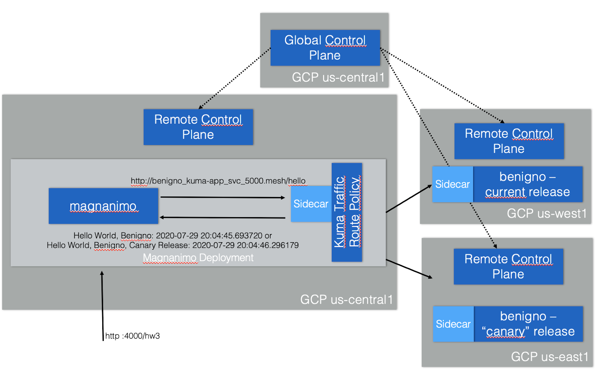
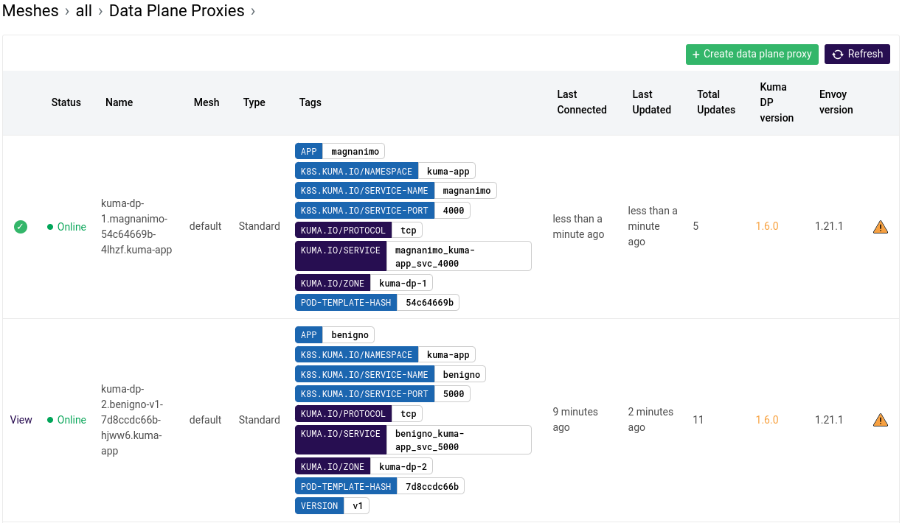
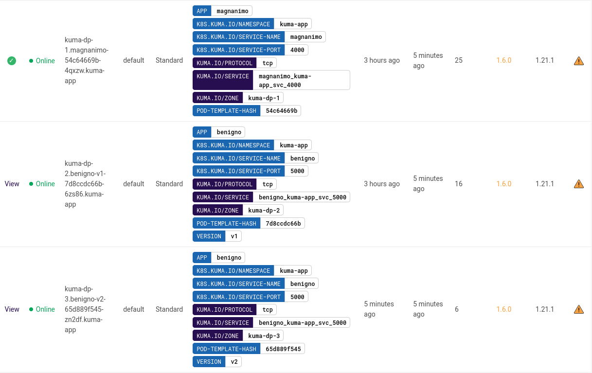

- [Executive Summary](#executive-summary)
  - [Objective](#objective)
- [Kuma Global control plane](#kuma-global-control-plane)
  - [VM installation](#vm-installation)
  - [Create Firewall rules](#create-firewall-rules)
  - [Create user for Kuma](#create-user-for-kuma)
  - [Configure Kuma working directory](#configure-kuma-working-directory)
  - [Download Kuma](#download-kuma)
  - [Configure Kuma license](#configure-kuma-license)
  - [Configure SELinux](#configure-selinux)
  - [Configure systemd service](#configure-systemd-service)
  - [Start Kuma global control plane](#start-kuma-global-control-plane)
  - [Check license](#check-license)
- [Setup Data Planes on OpenShift Clusters](#setup-data-planes-on-openshift-clusters)
  - [Kuma Data Plane 1](#kuma-data-plane-1)
  - [Kuma Data Plane 2](#kuma-data-plane-2)
  - [Kuma Data Plane 3](#kuma-data-plane-3)
  - [Verify control plane connectivity](#verify-control-plane-connectivity)
  - [Setting mTLS on Global Control Plane](#setting-mtls-on-global-control-plane)
- [2-Microservice Application Deployment](#2-microservice-application-deployment)
  - [Deploy Magnanimo](#deploy-magnanimo)
  - [Checking Magnanimo deployment](#checking-magnanimo-deployment)
  - [Deploy Benigno](#deploy-benigno)
  - [Checking Benigno deployment](#checking-benigno-deployment)
  - [Checking Kuma GUI](#checking-kuma-gui)
  - [Consuming Magnanimo and Benigno](#consuming-magnanimo-and-benigno)
  - [Expose Magnanimo](#expose-magnanimo)
- [2-Microservice Application - Canary Release](#2-microservice-application---canary-release)
  - [Check the Kuma GUI again](#check-the-kuma-gui-again)
  - [Checking benigno-v1 and benigno-v2 DataPlanes](#checking-benigno-v1-and-benigno-v2-dataplanes)
  - [Controlling the Canary Release Traffic](#controlling-the-canary-release-traffic)
  - [Defining a TrafficPermission policy](#defining-a-trafficpermission-policy)

# Executive Summary

## Objective

This document describes [Kong Mesh](https://docs.konghq.com/mesh) version `1.7` with
a Distributed Canary Release running on 3 OpenShift clusters in GCP.

Reference architecture



# Kuma Global control plane

## VM installation

In this guide, we will use the `fsi-env2` GCP project.

Otherwise you must create a project and enable billing on a project.

Create a new `Red Hat Enterprise Linux 8` VM Instance with the assigned tag `kuma-global-cp`.

NOTES:

In our case we create VM with ephemeral IP. Ok for testing, but **totally wrong** for production.
Should we change our guide? (I believe so)

```bash
export GCP_PROJECT_NAME=fsi-env2
export GCP_VM_NAME=kuma-global-cp-$RANDOM
export GCP_ZONE=us-central1-a

gcloud compute instances create $GCP_VM_NAME \
      --project=$GCP_PROJECT_NAME \
      --zone=$GCP_ZONE \
      --machine-type=e2-highcpu-4 \
      --network-interface=network-tier=PREMIUM,subnet=default \
      --maintenance-policy=MIGRATE \
      --provisioning-model=STANDARD \
      --tags=$GCP_VM_NAME \
      --create-disk=auto-delete=yes,boot=yes,device-name=$GCP_VM_NAME,image=projects/rhel-cloud/global/images/rhel-8-v20220519,mode=rw,size=20,type=projects/$GCP_PROJECT_NAME/zones/$GCP_ZONE/diskTypes/pd-balanced \
      --no-shielded-secure-boot \
      --shielded-vtpm \
      --shielded-integrity-monitoring \
      --reservation-affinity=any
```

## Create Firewall rules

```bash
gcloud compute --project=$GCP_PROJECT_NAME firewall-rules create kuma-cp-ds-$GCP_VM_NAME \
    --description="Kuma Discovery Service port" \
    --direction=INGRESS \
    --priority=1000 \
    --network=default \
    --action=ALLOW \
    --rules=tcp:5685 \
    --source-ranges=0.0.0.0/0 \
    --target-tags=$GCP_VM_NAME
```

⚠️ WARNING

Open `5681` port only for testing purpose.

For production need to use port `5682` (HTTPS version of the services available under 5681)

```bash
gcloud compute --project=$GCP_PROJECT_NAME firewall-rules create kuma-cp-api-$GCP_VM_NAME \
    --description="Kuma API server (with GUI)" \
    --direction=INGRESS \
    --priority=1000 \
    --network=default \
    --action=ALLOW \
    --rules=tcp:5681 \
    --source-ranges=0.0.0.0/0 \
    --target-tags=$GCP_VM_NAME
```

## Create user for Kuma

Connect to Global Control Plane VM via ssh and run

```bash
sudo adduser kuma --system --create-home
```

## Configure Kuma working directory

```bash
export KUMA_WORKING_DIR=/opt/kong
sudo mkdir -p $KUMA_WORKING_DIR
```

## Download Kuma

```bash
curl -L https://download.konghq.com/mesh-alpine/kong-mesh-1.7.0-rhel-amd64.tar.gz --output kong-mesh-1.7.0-rhel-amd64.tar.gz 
sudo tar xvf kong-mesh-1.7.0-rhel-amd64.tar.gz -C $KUMA_WORKING_DIR
```

## Configure Kuma license

Upload the license file to the virtual machine and save it to `/opt/kong/kong-mesh-1.7.0/license.json`

## Configure SELinux

```bash
sudo chown kuma:kuma -R $KUMA_WORKING_DIR
sudo restorecon -R -v $KUMA_WORKING_DIR
```

Check `kumactl` version

```bash
sudo ln -s $KUMA_WORKING_DIR/kong-mesh-1.7.0/bin/kumactl /usr/local/bin/kumactl
kumactl version
```

Output

```text
Client: Kong Mesh 1.7.0
Unable to connect to control plane: Get "http://localhost:5681/": dial tcp [::1]:5681: connect: connection refused
```

## Configure systemd service

The most relevant parameters when configuring the service are:

- `KUMA_ENVIRONMENT=universal` meaning it is not kubernetes
- `KUMA_MODE=global` for multizone instead of standalone
- `KMESH_LICENSE_PATH=/opt/kong/kong-mesh-1.7.0/license.json` to specify the path of the license
```bash
cat << EOF | sudo tee /etc/systemd/system/kuma-global-cp.service
# Possible improvements for limits
# https://access.redhat.com/solutions/1346533
[Unit]
Description=Kuma global control plane
Wants=network-online.target
After=network-online.target
Documentation=https://docs.konghq.com/mesh

[Service]
Environment=KUMA_ENVIRONMENT=universal
Environment=KUMA_MODE=global
Environment=KMESH_LICENSE_PATH=/opt/kong/kong-mesh-1.7.0/license.json
ExecStart=/opt/kong/kong-mesh-1.7.0/bin/kuma-cp run
Restart=always
TimeoutStopSec=60
User=kuma
[Install]
WantedBy=multi-user.target
EOF
```

## Start Kuma global control plane

```bash
sudo systemctl enable --now kuma-global-cp.service
sudo systemctl status kuma-global-cp.service 
sudo journalctl -f -u kuma-global-cp.service --no-pager -l
```

## Check license

```bash
export KUMA_KDS_URL=$(gcloud compute instances describe $GCP_VM_NAME  \
      --format='get(networkInterfaces[0].accessConfigs[0].natIP)' \
      --zone=$GCP_ZONE)
curl $KUMA_KDS_URL:5681/license
```

Output

```text
{
 "allowedDataplaneProxies": 100,
 "activeDataplaneProxies": 0,
 "expirationDate": "2023-03-21T00:00:00Z",
 "demo": false
}
```

# Setup Data Planes on OpenShift Clusters

Please follow to the [documentation](https://docs.openshift.com/container-platform/4.8/installing/installing_gcp/installing-gcp-default.html) to install Data Plane OpenShift clusters.

We need to deploy three clusters in GCP

- one clusters in zone `us-central1-a`
- one cluster in zone `us-east1-b`
- one cluster in zone `us-west1-b`

## Kuma Data Plane 1

Connect to `Kuma Data Plane 1` OpenShift cluster and run following command

```bash
kumactl install control-plane \
    --mode=zone \
    --zone=kuma-dp-1 \
    --ingress-enabled \
    --cni-enabled \
    --kds-global-address grpcs://$KUMA_KDS_URL:5685 | oc apply -f -
```

## Kuma Data Plane 2

Connect to `Kuma Data Plane 2` OpenShift cluster and the following command:

```bash
kumactl install control-plane \
    --mode=zone \
    --zone=kuma-dp-2 \
    --ingress-enabled \
    --cni-enabled \
    --kds-global-address grpcs://$KUMA_KDS_URL:5685 | oc apply -f -
```

## Kuma Data Plane 3

Connect to `Kuma Data Plane 3` OpenShift cluster and the following command:

```bash
kumactl install control-plane \
    --mode=zone \
    --zone=kuma-dp-3 \
    --ingress-enabled \
    --cni-enabled \
    --kds-global-address grpcs://$KUMA_KDS_URL:5685 | oc apply -f -
```

## Verify control plane connectivity

To verify zone control plane connections run `kumactl get zones` on global control plane VM or connect to Global Control Plane GUI - `echo http://$KUMA_KDS_URL:5681/gui`

```bash
kumactl get zones
```

Output

```text
NAME        AGE
kuma-dp-1   43m
kuma-dp-2   38m
kuma-dp-3   7s
```

## Setting mTLS on Global Control Plane

Connect to Global control plane VM via SSH and run following command

```bash
cat << EOF | kumactl apply -f -
type: Mesh
name: default
mtls:
  enabledBackend: ca-1
  backends:
    - name: ca-1
      type: builtin
EOF
```

# 2-Microservice Application Deployment

## Deploy Magnanimo

The deployment will be based on the `magnanimo` container image. It also
creates a Cluster IP based Service.

Connect to `Kuma Data Plane 1` OpenShift cluster and run following command:

```bash
oc new-project kuma-app
oc adm policy add-scc-to-group nonroot system:serviceaccounts:kuma-app
oc annotate namespace kuma-app kuma.io/sidecar-injection=enabled

cat <<EOF | oc apply -f -
apiVersion: apps/v1
kind: Deployment
metadata:
  name: magnanimo
  namespace: kuma-app
spec:
  replicas: 1
  selector:
    matchLabels:
      app: magnanimo
  template:
    metadata:
      annotations:
        kuma.io/gateway: enabled
      labels:
        app: magnanimo
    spec:
      containers:
      - name: magnanimo
        image: claudioacquaviva/magnanimo_kuma
        ports:
        - containerPort: 4000
---
apiVersion: v1
kind: Service
metadata:
  name: magnanimo
  namespace: kuma-app
  annotations:
    ingress.kubernetes.io/service-upstream: "true"
  labels:
    app: magnanimo
spec:
  type: ClusterIP
  ports:
    - port: 4000
      name: http
  selector:
    app: magnanimo
EOF
```

## Checking Magnanimo deployment

Please be sure that Dataplane was successfully created and `kuma-sidecar` container was injected to pod.

```bash
oc get pods -ojson -n kuma-app | jq '.items[] | .spec.containers[] | .name'
```

Output

```text
magnanimo
kuma-sidecar
```

```bash
oc get dataplane 
```

Output

```text
NAME                        AGE
magnanimo-54c64669b-4b2kz   2m24s
```

## Deploy Benigno

The same way we did for `magnanimo` we'll deploy `benigno` and another
ClusterIP based Service. Notice that, with Canary Release in mind,
differently from `magnino`, we named the deployment as `benigno-v1`.

Connect to `Kuma Data Plane 2` OpenShift cluster and run following command:

```bash
oc new-project kuma-app
oc adm policy add-scc-to-group nonroot system:serviceaccounts:kuma-app
oc annotate namespace kuma-app kuma.io/sidecar-injection=enabled

cat <<EOF | kubectl apply -f -
apiVersion: apps/v1
kind: Deployment
metadata:
  name: benigno-v1
  namespace: kuma-app
spec:
  replicas: 1
  selector:
    matchLabels:
      app: benigno
  template:
    metadata:
      labels:
        app: benigno
        version: v1
    spec:
      containers:
      - name: benigno
        image: claudioacquaviva/benigno
        ports:
        - containerPort: 5000
---
apiVersion: v1
kind: Service
metadata:
  name: benigno
  namespace: kuma-app
  labels:
    app: benigno
spec:
  type: ClusterIP
  ports:
    - port: 5000
      name: http
  selector:
    app: benigno
EOF
```

## Checking Benigno deployment

Please be sure that Dataplane was successfully created and `kuma-sidecar` container was injected to pod.

```bash
oc get pods -ojson -n kuma-app | jq '.items[] | .spec.containers[] | .name'
```

Output

```text
"benigno"
"kuma-sidecar"
```

```bash
oc get dataplane 
```

Output

```text
NAME                          AGE
benigno-v1-7d8ccdc66b-hjww6   14s
```

## Checking Kuma GUI

We should see all data plane proxies online.



## Consuming Magnanimo and Benigno

Now, we are ready to consume `magnanimo`. In order to do it so, let's
expose the `magnanimo` deployment first.

Connect to `Kuma Data Plane 1` OpenShift cluster and run following command:

## Expose Magnanimo

```bash
oc project kuma-app
oc expose service magnanimo --port 4000
oc port-forward service/magnanimo -n kuma-app 4000:4000
```

So running `http :4000` we reach our `magnanimo` microservice.

```bash
http :4000/hello
```

Output

```text
HTTP/1.0 200 OK
Content-Length: 51
Content-Type: text/html; charset=utf-8
Date: Wed, 30 Mar 2022 21:45:11 GMT
Server: Werkzeug/2.0.2 Python/3.8.10
Hello World, Magnanimo - 2022-03-30 21:45:11.359592
```

And that's the request where `magnanimo` calls `benigno`:

```bash
http :4000/hw3
```

```text
HTTP/1.0 200 OK
Content-Length: 49
Content-Type: text/html; charset=utf-8
Date: Wed, 30 Mar 2022 21:45:25 GMT
Server: Werkzeug/2.0.2 Python/3.8.10
Hello World, Benigno - 2022-03-30 21:45:25.672122
```

```bash
export MAGNANIMO_URL=$(oc get route -ojsonpath='{.items[].spec.host}')
```

```bash
while [ 1 ]; do curl $MAGNANIMO_URL/hw3; sleep 1; echo; done
```

# 2-Microservice Application - Canary Release

To exercise the Canary Release, let's deploy a new `benigno` version.

Connect to `Kuma Data Plane 3` OpenShift cluster and run following command

```bash
oc new-project kuma-app
oc adm policy add-scc-to-group nonroot system:serviceaccounts:kuma-app
oc annotate namespace kuma-app kuma.io/sidecar-injection=enabled
oc delete deployment benigno-v2
oc delete service benigno

cat <<EOF | oc apply -f -
apiVersion: v1
kind: Service
metadata:
  name: benigno
  namespace: kuma-app
  labels:
    app: benigno
spec:
  type: ClusterIP
  ports:
  - port: 5000
    name: http
  selector:
    app: benigno
---
apiVersion: apps/v1
kind: Deployment
metadata:
  name: benigno-v2
  namespace: kuma-app
spec:
  replicas: 1
  selector:
    matchLabels:
      app: benigno
  template:
    metadata:
      labels:
        app: benigno
        version: v2
    spec:
      containers:
      - name: benigno
        image: claudioacquaviva/benigno_rc
        ports:
        - containerPort: 5000
EOF
```

Check your loop again:

```text
Hello World, Benigno: 2021-02-02 15:52:20.259092
Hello World, Benigno: 2021-02-02 15:52:21.289091
Hello World, Benigno, Canary Release: 2021-02-02 15:52:25.411322
Hello World, Benigno: 2021-02-02 15:52:26.439072
Hello World, Benigno, Canary Release: 2021-02-02 15:52:27.469915
Hello World, Benigno: 2021-02-02 15:52:28.502851
Hello World, Benigno, Canary Release: 2021-02-02 15:52:29.535132
Hello World, Benigno: 2021-02-02 15:52:30.567788
Hello World, Benigno, Canary Release: 2021-02-02 15:52:31.608040
```

## Check the Kuma GUI again



## Checking benigno-v1 and benigno-v2 DataPlanes

Canary Release policies are implemented in Kuma by `Traffic Route`
policies.

The policies consider the labels we used in our deployments.

For instance, we use the label `version` in both `benigno-v1` and `benigno-v2` deployments as we can see below.

```bash
kumactl get dataplanes
```

Output

```text
MESH      NAME  TAGS      ADDRESS        AGE
default   kuma-dp-1.magnanimo-7cdc4c575c-cd5vr.kuma-app    app=magnanimo            10.131.0.123   3d
default   kuma-dp-2.benigno-v1-7d8ccdc66b-hqc9q.kuma-app   app=benigno version=v1   10.128.2.122   3d
default   kuma-dp-3.benigno-v2-65d889f545-6hv42.kuma-app   app=benigno version=v2   10.131.1.121   3d
```

## Controlling the Canary Release Traffic

As you can see in our loop output we have a round-robin Load Balancing
policy. Since it's a Canary Release, we want to control the load
routing to it. This can be achieved with a Kuma TrafficRoute Policy.

Connect to Global Control Plane VM via `ssh` and run:

```bash
cat << EOF | kumactl apply -f -
type: TrafficRoute
name: magnanimo-benigno
mesh: default
sources:
  - match:
      kuma.io/service: magnanimo_kuma-app_svc_4000
destinations:
  - match:
      kuma.io/service: benigno_kuma-app_svc_5000
conf:
  split:
    - weight: 10
      destination:
        kuma.io/service: benigno_kuma-app_svc_5000
        version: v1
    - weight: 90
      destination:
        kuma.io/service: benigno_kuma-app_svc_5000
        version: v2
EOF
```

Check the loop output again

```text
Hello World, Benigno - 2022-06-06 10:35:25.601313
Hello World, Benigno, Canary Release - 2022-06-06 10:35:26.104756
Hello World, Benigno, Canary Release - 2022-06-06 10:35:26.579529
Hello World, Benigno, Canary Release - 2022-06-06 10:35:27.034464
Hello World, Benigno, Canary Release - 2022-06-06 10:35:30.388434
```

## Defining a TrafficPermission policy

First of all, let's delete the `allow-all-default` Traffic Permission
policy created during the installation time, otherwise, the new one will
be meaningless.

```bash
kumactl delete traffic-permission allow-all-default
```

Apply the new Policy which allow communication only with `benigno v1`

```bash
cat << EOF | kumactl apply -f -
type: TrafficPermission
name: magnanimo-benigno-v1
mesh: default
sources:
  - match:
      kuma.io/service: magnanimo_kuma-app_svc_4000
destinations:
  - match:
      kuma.io/service: benigno_kuma-app_svc_5000
      version: v1
EOF
```

Check the loops output

```text
Hello World, Benigno - 2022-06-06 10:46:50.579531
500 Internal Server Error
Hello World, Benigno - 2022-06-06 10:46:51.400203
Hello World, Benigno - 2022-06-06 10:46:51.778348
500 Internal Server Error
500 Internal Server Error
Hello World, Benigno - 2022-06-06 10:46:51.775454
```

To allow the communication with both releases run:

```bash
cat << EOF | kumactl apply -f -
type: TrafficPermission
name: magnanimo-benigno-all
mesh: default
sources:
  - match:
      kuma.io/service: magnanimo_kuma-app_svc_4000
destinations:
  - match:
      kuma.io/service: benigno_kuma-app_svc_5000
EOF
```

Check the loops output

```text
Hello World, Benigno - 2022-06-06 10:51:48.668538
Hello World, Benigno, Canary Release - 2022-06-06 10:51:49.103168
Hello World, Benigno, Canary Release - 2022-06-06 10:51:49.565540
Hello World, Benigno, Canary Release - 2022-06-06 10:51:50.014323
Hello World, Benigno, Canary Release - 2022-06-06 10:51:50.469542
Hello World, Benigno, Canary Release - 2022-06-06 10:51:50.915276
```

To restore default `TrafficPermission`, please run

```bash
cat << EOF | kumactl apply -f -
type: TrafficPermission
name: allow-all-traffic
mesh: default
sources:
  - match:
      kuma.io/service: '*'
destinations:
  - match:
      kuma.io/service: '*'
EOF
```
